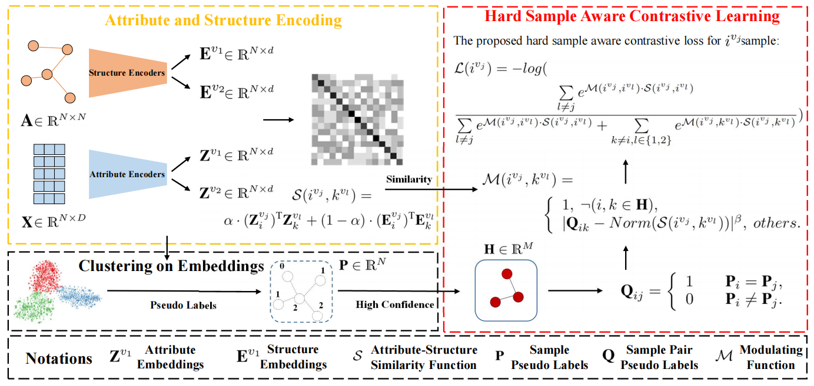
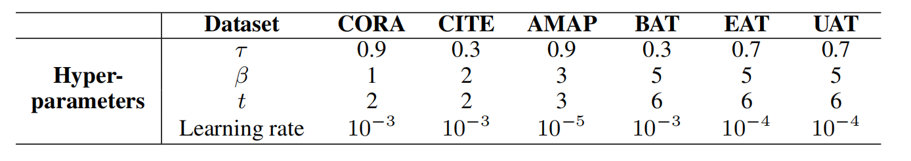
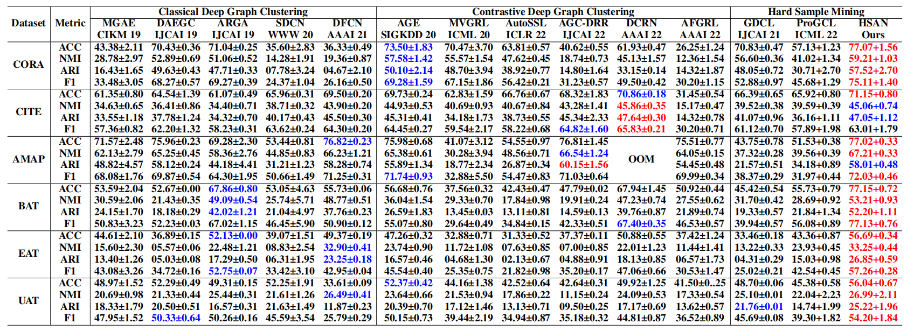
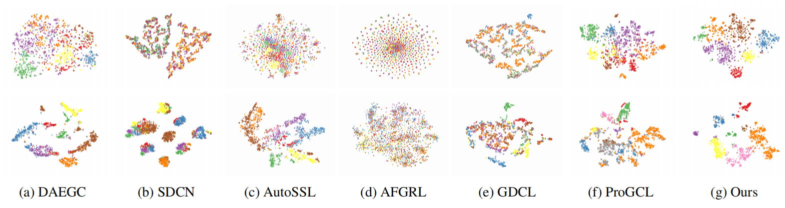

[stars-img]: https://img.shields.io/github/stars/yueliu1999/HSAN?color=yellow
[stars-url]: https://github.com/yueliu1999/HSAN/stargazers
[fork-img]: https://img.shields.io/github/forks/yueliu1999/HSAN?color=lightblue&label=fork
[fork-url]: https://github.com/yueliu1999/HSAN/network/members
[visitors-img]: https://visitor-badge.glitch.me/badge?page_id=yueliu1999.HSAN
[adgc-url]: https://github.com/yueliu1999/HSAN

# Hard Sample Aware Network

<p align="center">   
    <a href="https://pytorch.org/" alt="PyTorch">
      </a>
    <a href="https://aaai.org/Conferences/AAAI-23/" alt="Conference">
        </a>
<p/>


[![GitHub stars][stars-img]][stars-url]
[![GitHub forks][fork-img]][fork-url]
[![visitors][visitors-img]][adgc-url]


An official source code for paper Hard Sample Aware Network for Contrastive Deep Graph Clustering, accepted by AAAI 2023. Any communications or issues are welcomed. Please contact yueliu19990731@163.com. If you find this repository useful to your research or work, it is really appreciate to star this repository. :heart:

-------------

### Overview

<p align = "justify"> 
We propose a novel contrastive deep graph clustering method dubbed Hard Sample Aware Network (HSAN) by introducing a comprehensive similarity measure criterion and a general dynamic sample weighing strategy. Concretely, in our algorithm, the similarities between samples are calculated by considering both the attribute embeddings and the structure embeddings, better-revealing sample relationships and assisting hardness measurement. Moreover, under the guidance of the carefully collected high-confidence clustering information, our proposed weight modulating function will first recognize the positive and negative samples and then dynamically up-weight the hard sample pairs while down-weighting the easy ones. In this way, our method can mine not only the hard negative samples but also the hard positive sample.
<div  align="center">    
    
</div>


<div  align="center">    
      Figure 1: Illustration of the proposed Hard Sample Aware Network (HSAN).
</div>

### Requirements

The proposed HSAN is implemented with python 3.7 on a NVIDIA 3090 GPU. 

Python package information is summarized in **requirements.txt**:

- torch==1.7.1
- tqdm==4.59.0
- numpy==1.19.2
- munkres==1.1.4
- scikit_learn==1.2.0


### Quick Start

- Step1: use the **cora.zip** file or download other datasets from  [Awesome Deep Graph Clustering/Benchmark Datasets](https://github.com/yueliu1999/Awesome-Deep-Graph-Clustering#datasets-details) 

- Step2: unzip the dataset into the **./dataset** folder

- Step3: run

  ```
  python train.py
  ```

  the clustering results will be recorded in the **./results.csv** file


### Parameter settings

<div  align="center">    
    
</div>

<div  align="center">    
    Table 1: Parameter settings of six datasets.
</div>


### Clustering Results

<div  align="center">    
    
</div>
<div  align="center">    
    Table 2: Clustering results of our proposed HSAN and thirteen baselines on six datasets.
</div>


<div  align="center">    
    
</div>

<div  align="center">    
    Figure 2: 2D <i>t</i>-SNE visualization of seven methods on two datasets.
</div>


### Citation

If you find this project useful for your research, please cite your paper with the following BibTeX entry.

```
@inproceedings{HSAN,
  title={Hard Sample Aware Network for Contrastive Deep Graph Clustering},
  author={Liu, Yue and Yang, Xihong and Zhou, Sihang and Liu, Xinwang and Wang, Zhen and Liang, Ke and Tu, Wenxuan and Li, Liang and Duan, Jingcan, and Chen, Cancan},
  booktitle={Proc. of AAAI},
  year={2023}
}

@article{Deep_graph_clustering_survey,
 author = {Liu, Yue and Xia, Jun and Zhou, Sihang and Wang, Siwei and Guo, Xifeng and Yang, Xihong and Liang, Ke and Tu, Wenxuan and Li, Z. Stan and Liu, Xinwang},
 journal = {arXiv preprint arXiv:2211.12875},
 title = {A Survey of Deep Graph Clustering: Taxonomy, Challenge, and Application},
 year = {2022}
}
```


